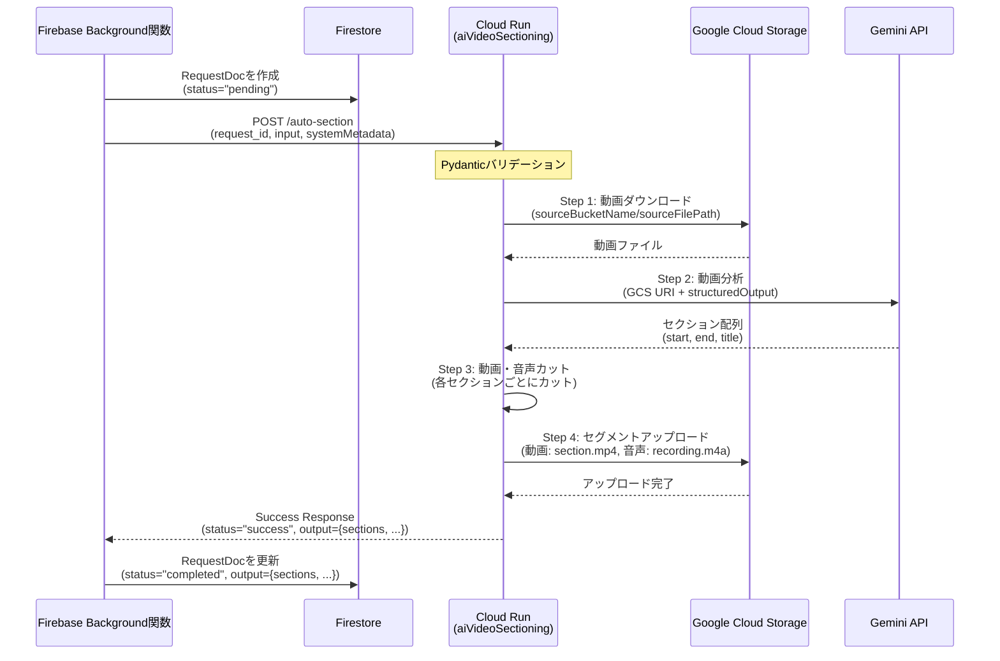

# AI 動画セクション化マイクロサービス

<!-- Service: aiVideoSectioning -->

## 目的

Gemini structuredOutput を使用して動画を自動的に分析し、適切なセクションに分割して、動画と音声をカットして Google Cloud Storage に保存する Cloud Run マイクロサービスです。Firebase Background 関数からの呼び出しを想定した **RequestDoc 黄金テンプレート準拠** の実装を提供します。

**対象ユースケース**: 音声付き動画を AI で自動的にセクション分割し、各セクションの動画と音声を GCS に保存して、後続処理（AI ナレーション生成など）の入力として利用

---

## 🎯 機能概要

### コア機能

1. **GCS 動画ダウンロード**: Google Cloud Storage から動画ファイルを一時領域にダウンロード
2. **Gemini 分析**: Gemini structuredOutput で動画を分析し、適切なセクション分割ポイントを取得
3. **動画・音声カット**: 各セクションごとに動画と音声をカット
4. **セグメントアップロード**: カットされた動画と音声セグメントを GCS にアップロード
5. **進捗ログ記録**: Firestore へのリアルタイム進捗ログ記録（デバッグ目的）

### 技術スタック

| レイヤー           | 技術                 | 用途                       |
| ------------------ | -------------------- | -------------------------- |
| **Web Framework**  | Flask                | HTTP API サーバー          |
| **AI 分析**        | Gemini 2.0 Flash Exp | 動画分析・セクション検出   |
| **動画処理**       | MoviePy + FFmpeg     | 動画分割・音声抽出         |
| **バリデーション** | Pydantic             | リクエストスキーマ検証     |
| **レスポンス統一** | ResponseFormatter    | 標準レスポンスフォーマット |
| **Storage**        | Google Cloud Storage | 動画・音声ファイル保存     |
| **Logging**        | Cloud Firestore      | 進捗ログ記録               |
| **Container**      | Docker               | Cloud Run デプロイ         |

---

## 🏗 アーキテクチャ

### RequestDoc 黄金テンプレート準拠

このマイクロサービスは、Vohance プロジェクトの **RequestDoc 黄金テンプレート** に準拠しています。



**重要な設計原則**:

- ✅ Cloud Run は **Output のみを返却** (ビジネスロジック実行)
- ✅ Firebase Background 関数が **Status 更新** (RequestDoc の status フィールド)
- ✅ `input`/`systemMetadata` の 2 層構造で一貫性を保つ（RequestDoc 黄金テンプレート準拠）
- ✅ ResponseFormatter を使用した統一レスポンスフォーマット

### ディレクトリ構造

```
aiVideoSectioning/
├── main.py                                  # Flask アプリケーション
├── requirements.txt                         # Python 依存関係
├── Dockerfile                               # コンテナイメージ定義
├── deploy.sh                                # デプロイスクリプト
├── openapi.yaml                             # OpenAPI 3.0 仕様
├── README.md                                # このファイル
├── endpoints/
│   ├── auto_section/
│   │   ├── execute.py                       # /auto-section エンドポイント実装
│   │   ├── request_schema.py                # リクエストスキーマ定義
│   │   └── steps/
│   │       ├── step1_download.py            # Step 1: 動画ダウンロード
│   │       ├── step2_analyze_with_gemini.py # Step 2: Gemini分析
│   │       ├── step3_cut_video_audio.py     # Step 3: 動画・音声カット
│   │       └── step4_upload.py              # Step 4: GCSアップロード
│   └── health/
│       └── execute.py                       # /health エンドポイント実装
└── localPackages/
    ├── common/                               # 共通パッケージ
    │   ├── context.py                        # コンテキスト管理
    │   ├── logger.py                         # ログ管理
    │   ├── gcs_storage.py                     # GCS操作
    │   ├── firestore_client.py                # Firestore操作
    │   ├── request_validator.py              # リクエスト検証
    │   └── response_formatter.py             # レスポンス整形
    └── core/
        └── video_audio_processor.py          # 動画・音声処理ロジック
```

---

## 📋 処理フロー

### Step 1: 動画ダウンロード

- GCS から動画ファイルを一時領域にダウンロード
- ファイルサイズ確認・バリデーション

### Step 2: Gemini 分析

- GCS URI を Gemini API に渡して動画を分析
- structuredOutput でセクション配列（start, end, title）を取得
- セクションを start 時刻でソート

### Step 3: 動画・音声カット

- 各セクションごとに動画をカット（MoviePy 使用）
- 各セクションごとに音声を抽出（FFmpeg 使用）
- 一時ファイルとして保存

### Step 4: GCS アップロード

- カットされた動画セグメントを GCS にアップロード
- カットされた音声セグメントを GCS にアップロード
- 出力パス情報をレスポンスに含める

---

## 🚀 デプロイ

### 前提条件

- Google Cloud SDK (`gcloud`) がインストール済み
- プロジェクトに必要な API が有効化済み:
  - Cloud Storage API
  - Firestore API
  - Vertex AI API
  - Cloud Build API

### デプロイ手順

```bash
cd backend/microservice/individual/aiVideoSectioning
./deploy.sh
```

デプロイスクリプトは以下を自動実行します:

1. 必要な API の有効化確認
2. Docker イメージのビルド（Cloud Build）
3. Cloud Run へのデプロイ

### 環境変数

デプロイ時に設定される環境変数:

- `GOOGLE_CLOUD_PROJECT`: GCP プロジェクト ID
- `DEBUG`: デバッグモード（デフォルト: false）
- `MAX_VIDEO_SIZE_MB`: 最大動画サイズ（デフォルト: 1000MB）

---

## 🔧 ローカル開発

### 環境準備

```bash
# 仮想環境作成
python3 -m venv venv
source venv/bin/activate  # Windows: venv\Scripts\activate

# 依存関係インストール
pip install -r requirements.txt

# 環境変数設定
export GOOGLE_CLOUD_PROJECT=vohance-dev
export DEBUG=true
export TEMP_DIR=/tmp/video_processing
```

### ローカル実行

```bash
python main.py
```

サービスは `http://localhost:8080` で起動します。

### テストリクエスト

```bash
curl -X POST http://localhost:8080/auto-section \
  -H "Content-Type: application/json" \
  -d '{
    "request_id": "test_123",
    "input": {
      "sourceBucketName": "your-bucket",
      "sourceFilePath": "path/to/video.mp4",
      "outputBucketName": "your-bucket",
      "videoId": "video123",
      "projectId": "project123"
    },
    "systemMetadata": {
      "organizationId": "org123",
      "spaceId": "space123",
      "loggingCollectionId": "logs",
      "loggingDocumentId": "doc123",
      "requestedBy": {"email": "test@example.com", "role": 2},
      "isCommand": false,
      "isOouiCrud": true,
      "isLlmCall": true,
      "isAdminCrud": false
    }
  }'
```

---

## 📊 レスポンス形式

### 成功レスポンス

```json
{
  "status": "success",
  "request_id": "req_1234567890_abcdefgh",
  "output": {
    "sections": [
      {
        "sectionId": "section-0",
        "index": 0,
        "startTime": 0.0,
        "endTime": 15.5,
        "title": "イントロダクション",
        "videoSegment": {
          "bucketName": "your-bucket",
          "gcsFilePath": "organizations/.../section.mp4",
          "duration": 15.5,
          "sizeBytes": 1234567
        },
        "audioSegment": {
          "bucketName": "your-bucket",
          "gcsFilePath": "organizations/.../recording.m4a",
          "duration": 15.5,
          "sizeBytes": 234567
        }
      }
    ],
    "apiRequestId": "req_1234567890_abcdefgh",
    "processingTime": 45.2
  },
  "processing_time": 45.2
}
```

---

## ⚠️ 注意事項

1. **Gemini API 制限**: 動画ファイルサイズに制限があります（通常 20MB 以下）
2. **処理時間**: Gemini 分析と動画カット処理のため、処理時間が長くなる可能性があります
3. **リソース**: Cloud Run のメモリと CPU を多めに割り当てることを推奨します（32Gi, 8CPU：Cloud Run設定上の最大値／WebM→MP4変換爆速化）

---

## 🔍 トラブルシューティング

### Gemini API エラー

- **エラー**: "Gemini API returned no candidates"
  - **原因**: 動画ファイルが大きすぎる、または Gemini API の制限に達している
  - **対策**: 動画ファイルサイズを確認、または動画を圧縮

### 動画カットエラー

- **エラー**: "FFmpeg エラー"
  - **原因**: FFmpeg のインストール不備、または動画フォーマット非対応
  - **対策**: Dockerfile で FFmpeg が正しくインストールされているか確認

### GCS アップロードエラー

- **エラー**: "Permission denied"
  - **原因**: GCS への書き込み権限がない
  - **対策**: Cloud Run サービスアカウントに適切な権限を付与
