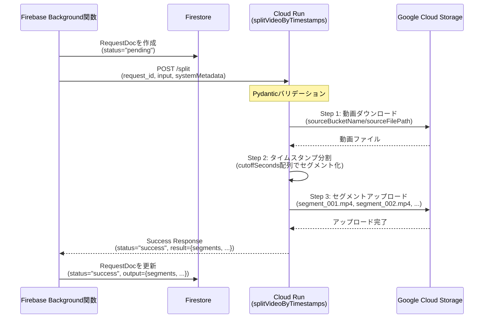
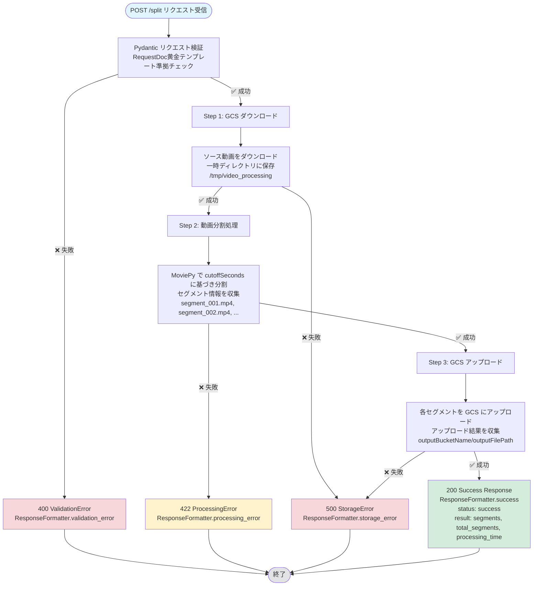

# 動画タイムスタンプ分割マイクロサービス

<!-- Service: splitVideoByTimestamps -->

## 目的

指定されたタイムスタンプで動画を分割し、Google Cloud Storage に保存する Cloud Run マイクロサービスです。Firebase Background 関数からの呼び出しを想定した **RequestDoc 黄金テンプレート準拠** の実装を提供します。

**対象ユースケース**: 長尺動画をセクション単位に分割して GCS に保存し、後続処理（ナレーション生成、字幕付与など）の入力として利用

---

## 📄 API 仕様書（OpenAPI）

**⚠️ リクエスト/レスポンス仕様、エンドポイント定義、スキーマ詳細は [openapi.yaml](./openapi.yaml) を参照してください。**

OpenAPI 3.0 仕様に準拠した完全な API 仕様を提供しています。

### openapi.yaml で管理される情報

| カテゴリ               | 内容                                                      | 参照先                                         |
| ---------------------- | --------------------------------------------------------- | ---------------------------------------------- |
| **エンドポイント定義** | POST /split, GET /health の完全な仕様                     | [paths](./openapi.yaml#L33-L200)               |
| **リクエストスキーマ** | input/systemMetadata 構造、フィールド定義、バリデーションルール | [SplitVideoRequest](./openapi.yaml#L204-L286)  |
| **レスポンススキーマ** | SuccessResponse, ErrorResponse の完全な型定義             | [components/schemas](./openapi.yaml#L329-L524) |
| **エラーハンドリング** | 400/422/500 エラーの詳細な例とフォーマット                | [responses](./openapi.yaml#L108-L176)          |
| **実行例**             | 基本的な使用例と Firestore ログ記録付き例                 | [examples](./openapi.yaml#L63-L94)             |

### この README で管理される情報

| カテゴリ                   | 内容                                                        |
| -------------------------- | ----------------------------------------------------------- |
| **アーキテクチャ**         | RequestDoc 黄金テンプレート準拠のシステム間連携、処理フロー |
| **デプロイ手順**           | Cloud Run へのデプロイ方法、環境設定                        |
| **ローカル開発**           | 開発環境構築、テスト実行方法                                |
| **トラブルシューティング** | よくある問題と解決方法                                      |
| **実装チェックリスト**     | 初めて触る開発者向けのガイド                                |

---

## 📋 目次

- [API 仕様書（OpenAPI）](#-api仕様書openapi)
- [機能概要](#-機能概要)
- [アーキテクチャ](#-アーキテクチャ)
  - [RequestDoc 黄金テンプレート準拠](#requestdoc黄金テンプレート準拠)
  - [ディレクトリ構造](#ディレクトリ構造)
  - [処理フロー](#処理フロー)
- [デプロイ](#-デプロイ)
  - [前提条件](#前提条件)
  - [デプロイ手順](#デプロイ手順)
- [ローカル開発](#-ローカル開発)
  - [環境準備](#環境準備)
  - [ローカル実行](#ローカル実行)
  - [テストリクエスト](#テストリクエスト)
- [設定](#-設定)
- [トラブルシューティング](#-トラブルシューティング)
- [実装チェックリスト](#-実装チェックリスト)
- [ドキュメント作成ガイドライン](#-ドキュメント作成ガイドライン)

---

## 🎯 機能概要

### コア機能

1. **GCS 動画ダウンロード**: Google Cloud Storage から動画ファイルを一時領域にダウンロード
2. **タイムスタンプ分割**: MoviePy を使用して指定されたタイムスタンプで動画を複数セグメントに分割
3. **セグメントアップロード**: 分割された動画セグメントを GCS にアップロード
4. **進捗ログ記録**: Firestore へのリアルタイム進捗ログ記録（デバッグ目的）

### 技術スタック

| レイヤー           | 技術                 | 用途                       |
| ------------------ | -------------------- | -------------------------- |
| **Web Framework**  | Flask                | HTTP API サーバー          |
| **動画処理**       | MoviePy + FFmpeg     | 動画分割・エンコーディング |
| **バリデーション** | Pydantic             | リクエストスキーマ検証     |
| **レスポンス統一** | ResponseFormatter    | 標準レスポンスフォーマット |
| **Storage**        | Google Cloud Storage | 動画ファイル保存           |
| **Logging**        | Cloud Firestore      | 進捗ログ記録               |
| **Container**      | Docker               | Cloud Run デプロイ         |

### タイムスタンプ分割ロジック

**例**: `cutoffSeconds: [10, 30, 60]` を指定した場合

| セグメント | 開始時刻 | 終了時刻   | ファイル名        |
| ---------- | -------- | ---------- | ----------------- |
| 1          | 0 秒     | 10 秒      | `segment_001.mp4` |
| 2          | 10 秒    | 30 秒      | `segment_002.mp4` |
| 3          | 30 秒    | 60 秒      | `segment_003.mp4` |
| 4          | 60 秒    | 動画の終端 | `segment_004.mp4` |

**ルール**:

- セグメント数 = `cutoffSeconds.length + 1`
- 最後のセグメントは動画の終端まで
- ファイル名は 3 桁ゼロパディング（`segment_001.mp4`, `segment_002.mp4`, ...）

---

## 🏗 アーキテクチャ

### RequestDoc 黄金テンプレート準拠

このマイクロサービスは、Vohance プロジェクトの **RequestDoc 黄金テンプレート** に準拠しています。



**重要な設計原則**:

- ✅ Cloud Run は **Output のみを返却** (ビジネスロジック実行)
- ✅ Firebase Background 関数が **Status 更新** (RequestDoc の status フィールド)
- ✅ `input`/`systemMetadata` の 2 層構造で一貫性を保つ（RequestDoc 黄金テンプレート準拠）
- ✅ ResponseFormatter を使用した統一レスポンスフォーマット

### ディレクトリ構造

```
splitVideoByTimestamps/
├── main.py                                  # Flask アプリケーション
├── requirements.txt                         # Python 依存関係
├── Dockerfile                               # コンテナイメージ定義
├── deploy.sh                                # デプロイスクリプト
├── openapi.yaml                             # OpenAPI 3.0 仕様（API仕様の単一情報源）
├── sandbox.http                             # HTTP テストリクエスト
├── README.md                                # このファイル（アーキテクチャ・運用ガイド）
│
├── endpoints/                               # エンドポイント実装
│   ├── split/
│   │   ├── execute.py                       # /split エンドポイント処理
│   │   ├── request_schema.py                # Pydantic リクエストスキーマ
│   │   └── steps/                           # 段階的処理実装（Orchestratorパターン）
│   │       ├── step1_download.py            # Step 1: GCS ダウンロード
│   │       ├── step2_process.py             # Step 2: 動画分割処理
│   │       └── step3_upload.py              # Step 3: GCS アップロード
│   └── health/
│       └── execute.py                       # /health エンドポイント処理
│
└── localpackage/                            # 共通ユーティリティ
    ├── __init__.py
    ├── context.py                           # リクエストコンテキスト管理
    ├── logger.py                            # 構造化ログ
    ├── gcs_storage.py                       # GCS 操作
    ├── video_processor.py                   # MoviePy 動画処理
    ├── request_validator.py                 # Pydantic バリデーション
    ├── response_formatter.py                # レスポンスフォーマット統一（全マイクロサービス共通）
    └── firestore_client.py                  # Firestore クライアント
```

**アーキテクチャ原則**:

- **endpoints/**: エンドポイント単位で責務を分離（単一責任の原則）
- **steps/**: 各エンドポイント内の処理を段階（step1, step2, step3）に分割（Orchestrator パターン）
- **localpackage/**: 全エンドポイントで共通利用するユーティリティ（DRY 原則）
- **openapi.yaml**: API 仕様の単一情報源（Single Source of Truth）

### 処理フロー



**エラーハンドリング**:

- 各 Step で例外が発生した場合、ResponseFormatter を使用して適切なエラーレスポンスを返却
- 詳細なエラーフォーマットは [openapi.yaml のエラーレスポンススキーマ](./openapi.yaml#L491-L524) を参照

---

## 🚀 デプロイ

### 前提条件

- **Google Cloud Project** の設定
- **gcloud CLI** のインストールと認証
- **必要な API の有効化**:
  - Cloud Storage API
  - Cloud Firestore API
  - Cloud Build API
  - Cloud Run API
- **適切な権限**:
  - Cloud Run 管理者
  - Storage 管理者
  - Firestore 管理者

### デプロイ手順

#### 1. プロジェクト ID の設定

```bash
export PROJECT_ID="vohance-dev"
gcloud config set project $PROJECT_ID
```

#### 2. deploy.sh の確認

```bash
cat deploy.sh
# PROJECT_ID が正しいことを確認
# SERVICE_NAME が正しいことを確認
```

#### 3. デプロイスクリプトの実行

```bash
chmod +x deploy.sh
./deploy.sh
```

**デプロイスクリプトの動作**:

1. `gcloud builds submit` で Docker イメージをビルド
2. `gcloud run deploy` で Cloud Run サービスをデプロイ
3. サービス URL が表示される

#### 4. デプロイ確認

```bash
# ヘルスチェックで確認
SERVICE_URL=$(gcloud run services describe split-video-by-timestamps --region=asia-northeast1 --format='value(status.url)')
curl ${SERVICE_URL}/health
```

**期待される出力**: `{"status": "healthy", ...}`

---

## 🧪 ローカル開発

### 環境準備

#### 1. FFmpeg のインストール（必須）

MoviePy は FFmpeg に依存しています。

```bash
# macOS
brew install ffmpeg

# Ubuntu/Debian
sudo apt-get update
sudo apt-get install ffmpeg

# Windows (Chocolatey)
choco install ffmpeg

# インストール確認
ffmpeg -version
```

#### 2. Python 依存関係のインストール

```bash
pip install -r requirements.txt
```

#### 3. 環境変数の設定

`.env` ファイルを作成:

```env
GOOGLE_CLOUD_PROJECT=vohance-dev
PORT=8080
DEBUG=true
```

### ローカル実行

```bash
python main.py
```

**起動ログ例**:

```
✅ dotenv読み込み成功
🚀 アプリケーション初期化開始
🌐 プロジェクトID: vohance-dev
✅ API クライアント初期化完了
🎉 split-video-by-timestamps サービスを開始します
🌐 アクセス URL: http://localhost:8080
❤️  ヘルスチェック: http://localhost:8080/health
✂️  動画分割: http://localhost:8080/split
```

### テストリクエスト

#### sandbox.http を使用（推奨）

VS Code の REST Client 拡張機能を使用:

1. `sandbox.http` を開く
2. リクエストの上にある "Send Request" をクリック

**リクエスト例**: `sandbox.http` に以下が含まれています

- 基本的な動画分割リクエスト
- Firestore ログ記録付きリクエスト
- ヘルスチェックリクエスト

#### curl を使用

**ヘルスチェック**:

```bash
curl http://localhost:8080/health
```

**動画分割** (詳細なリクエストフォーマットは [openapi.yaml](./openapi.yaml#L66-L94) を参照):

```bash
curl -X POST http://localhost:8080/split \
  -H "Content-Type: application/json" \
  -d @- <<'EOF'
{
  "request_id": "splitVideoRequest_test123",
  "input": {
    "sourceBucketName": "vohance-sandbox",
    "sourceFilePath": "test_video.mp4",
    "outputBucketName": "vohance-sandbox",
    "outputFilePath": [
      "test_output/segment-1.mp4",
      "test_output/segment-2.mp4",
      "test_output/segment-3.mp4",
      "test_output/segment-4.mp4"
    ],
    "cutoffSeconds": [5, 10, 15],
    "videoId": "video_test",
    "projectId": "project_test"
  },
  "systemMetadata": {
    "organizationId": "org_test",
    "spaceId": "space_test",
    "loggingCollectionId": "requestLogs",
    "loggingDocumentId": "test_log_123",
    "requestedBy": {"email": "system@example.com", "role": 2},
    "isCommand": false,
    "isOouiCrud": true,
    "isLlmCall": false,
    "isAdminCrud": false
  }
}
EOF
```

---

## ⚙️ 設定

### 環境変数

| 変数名                 | 説明                     | デフォルト値            | 必須 |
| ---------------------- | ------------------------ | ----------------------- | ---- |
| `GOOGLE_CLOUD_PROJECT` | GCP プロジェクト ID      | -                       | ✅   |
| `PORT`                 | サービスポート           | `8080`                  | ❌   |
| `DEBUG`                | デバッグモード           | `false`                 | ❌   |
| `MAX_VIDEO_SIZE_MB`    | 最大動画サイズ（MB）     | `1000`                  | ❌   |
| `TEMP_DIR`             | 一時ファイルディレクトリ | `/tmp/video_processing` | ❌   |
| `CLEANUP_TEMP_FILES`   | 一時ファイル自動削除     | `true`                  | ❌   |
| `MAX_SEGMENTS`         | 最大セグメント数         | `100`                   | ❌   |
| `VIDEO_CODEC`          | 動画コーデック           | `libx264`               | ❌   |
| `AUDIO_CODEC`          | 音声コーデック           | `aac`                   | ❌   |
| `VIDEO_BITRATE`        | 動画ビットレート         | `5000k`                 | ❌   |
| `AUDIO_BITRATE`        | 音声ビットレート         | `192k`                  | ❌   |

**サポートされる動画フォーマット**: `mp4`, `mov`, `avi`, `mkv`

---
