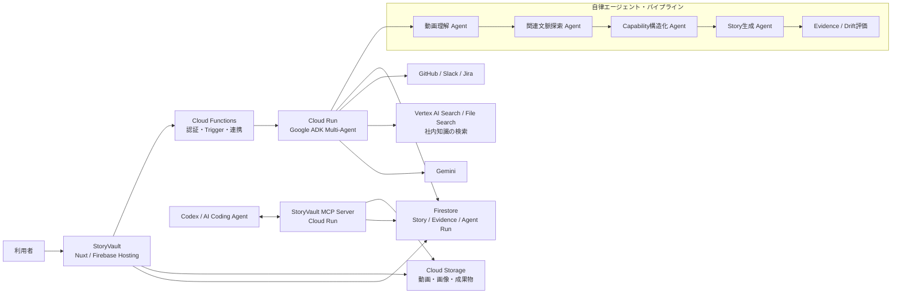

# StoryVault — ProtoPedia エントリー原稿

> DevOps × AI Agent Hackathon 2026 提出用。`【要入力】` は公開前に差し替える。
>
> 公式要項確認日: 2026-07-11 / 提出期限: 2026-07-12 23:59

## ProtoPedia 登録項目

### 作品ステータス

完成

### 作品タイトル

StoryVault — 操作動画から「実装できるユーザーストーリー」を育てるAIエージェント

### 概要

StoryVaultは、仕様書だけでは残らない「実際の操作」と、その背景にある会話・チケット・コードをAIエージェントが横断し、根拠付きのユーザーストーリーへ変換するDevOps基盤です。

画面を操作した動画を登録すると、GeminiとGoogle ADKで構築した複数のAIエージェントが、動画・音声・スクリーンショットを解析。さらにGitHub、Slack、Jira、社内ドキュメントから関連情報を自律的に探索し、受け入れ条件、証拠、コード参照、仕様と実装のドリフトまでを一つのStory SSOT（Single Source of Truth）に整理します。

完成したコンテキストは、人がStoryVaultの画面でレビューできるだけでなく、MCPを通じてCodexなどのコーディングエージェントにも直接渡せます。「人が見た現実」と「AIが実装に使う文脈」を同じ根拠につなぎ、AIコーディングの速さを、チームで安心して運用できる速さへ変えます。

### 紹介画像

最大5枚を、次の順序で登録する。

1. ヒーロー画像: 「操作動画 → AI Agent → Story SSOT → Coding Agent」の全体像
2. StoryVaultのアプリケーション／ストーリー一覧画面
3. 操作動画の解析結果（字幕・スクリーンショット・ストーリー候補）
4. Story詳細（受け入れ条件・evidence・コード参照・drift）
5. MCP経由でコーディングエージェントへコンテキストを渡している画面

### 動画

【要入力: YouTubeまたはVimeoのデモ動画URL】

推奨タイトル: `StoryVault | 操作動画から実装可能なユーザーストーリーを生成するAIエージェント`

### システム構成

以下を図として画像化し、ProtoPediaへアップロードする。

図中で強調する必須技術は、アプリケーション実行基盤のCloud Run / Cloud Functionsと、AI技術のGemini / Google ADKである。

### 開発素材

- Google Cloud: Cloud Run、Cloud Functions（2nd gen）、Cloud Build、Cloud Storage、Firestore、Firebase Hosting
- AI / Agent: Gemini、Google Agent Development Kit（ADK）、Vertex AI Search / File Search
- Frontend: Nuxt、Vue、TypeScript、Pinia、Zod
- Integration: GitHub API、Slack API、Jira API、Google Drive
- Agent interface: Model Context Protocol（MCP）
- Observability / DevOps: GitHub、Cloud Build、Datadog LLM Observability
- Media pipeline: FFmpeg、Speech-to-Textを含む動画・字幕処理

### タグ

- `findy_hackathon`（必須）
- `AIエージェント`
- `GoogleCloud`
- `Gemini`
- `ADK`
- `DevOps`
- `MCP`
- `CloudRun`
- `ユーザーストーリー`

### 関連URL

- デモ: https://storyvault-dev.web.app/admin/storyvault/
- GitHub: 【要入力: 公開リポジトリURL。非公開の場合は省略】
- StoryVault MCP: https://storyvault-mcp-mdgjayj74q-an.a.run.app/mcp
- デモ動画: 【要入力: YouTubeまたはVimeo URL】

---

## ストーリー

### 1. 解決したい課題と、その背景

AIコーディングによって、コードを書く速度は劇的に上がりました。しかし、開発全体が同じ速度で良くなったわけではありません。

現場で本当に時間がかかっているのは、「何を、なぜ作るのか」をAIと人に正しく伝えることです。仕様はドキュメント、判断の経緯はSlack、作業はJira、実装はGitHub、実際の振る舞いは操作した人の頭の中や録画に分散します。その結果、次の問題が起きます。

- AIへ渡す文脈が担当者ごとに違い、生成結果の品質が安定しない
- 画面上では動いているのに、仕様書やチケットが更新されない
- PRを見ても、どのユーザー価値と受け入れ条件を満たす変更か分からない
- 後から参加した人やAIエージェントが、過去の判断根拠を再現できない
- 実装速度が上がるほど、仕様と現実の差分である「コンテキスト・ドリフト」が蓄積する

特に、プロダクトの現実を最も端的に示すのは「ユーザーが実際に操作している画面」です。しかし、操作動画は見るには分かりやすくても、そのままでは検索・比較・実装に使いにくい非構造データです。

StoryVaultは、この操作動画を入口にします。AIエージェントが動画の時間軸、字幕、画面キャプチャを読み、関連するGitHub PR、Slackの議論、Jira Issue、社内ドキュメントを探し、ユーザーストーリーと受け入れ条件へ構造化します。単なる議事録生成ではなく、実装とレビューに使える「根拠付きのStory SSOT」を継続的に育てます。

### 2. 想定する利用ユーザー

中心となるユーザーは、AIを使ってソフトウェアを作る開発チームです。

- プロダクトマネージャー: 実際の操作や会話から、仕様と受け入れ条件を更新したい
- エンジニア: 実装前に、関連仕様・PR・コード・判断根拠を一度に把握したい
- レビュアー / QA: 変更がどの受け入れ条件を満たし、何が未確認かを知りたい
- 新しく参加したメンバー: 断片的な資料を巡回せず、機能の背景から現状まで理解したい
- AIコーディングエージェント: 人と同じStory SSOTをMCPから取得し、根拠に沿って実装したい

たとえばPMが「この操作フローを次の開発に反映したい」と思ったとき、動画を録画してStoryVaultへ登録します。StoryVaultが関連情報を集め、ストーリー候補を提示。人は根拠を見ながら採用・修正し、エンジニアやAIへそのまま渡せます。

### 3. プロダクトの特徴

#### 特徴1: 操作動画を、時間軸付きの実装コンテキストへ変換

動画を単に要約するのではなく、無音区間の整理、字幕、画面キャプチャ、操作意図、ストーリー候補を時間範囲と結び付けます。各候補には字幕の引用元と代表スクリーンショットが残るため、「AIがなぜそのストーリーを作ったのか」を人が確かめられます。

#### 特徴2: 複数のAIエージェントが、自律的に次の仕事を判断・実行

StoryVaultの中心はAIエージェントです。登録された素材に応じて、動画理解、関連文脈探索、Capability構造化、Story生成を分担します。

関連文脈探索エージェントは、動画から得た機能名・操作・画面情報を手がかりに、GitHub、Slack、Jira、ナレッジを横断検索し、関連度と理由を付けます。Story生成エージェントは、それらの根拠を読み、ユーザー、目的、価値、受け入れ条件、詳細仕様、confidence、driftを組み立て、Firestoreへ保存します。固定ルールで項目を埋めるだけではなく、不足する根拠や矛盾を判断するため、AIエージェントである必然性があります。

#### 特徴3: 「答え」だけでなく、Evidence IDまで保存

生成されたストーリーには、元動画、字幕区間、スクリーンショット、ドキュメント、Jira Issue、Slackメッセージ、GitHub PR／commit／file pathをevidenceとして紐付けます。受け入れ条件ごとに `covered / missing / conflict / unknown` を持たせ、confidenceとdrift理由を表示します。

AIの出力を信じるのではなく、AIの判断を検証できる設計です。

#### 特徴4: 人の画面とAIの入口を、同じSSOTにつなぐMCP

StoryVault MCP Serverは、アプリケーション、ストーリー、操作動画、evidence、関連アセットをコーディングエージェントへ提供します。CodexなどのAIは、StoryVaultのStory IDを指定するだけで、Markdown / HTMLレポート、動画、画像、関連PRを含むコンテキストを取得できます。

人がレビューしたストーリーと、AIが実装に使うプロンプトが分断されません。これがStoryVaultの最大の体験価値です。

#### 特徴5: DevOpsの「つくる・まわす・とどける」を一周させる

- つくる: Gemini + ADKのマルチエージェントで、現実の操作からStory SSOTを生成
- まわす: GitHub連携、Cloud Build、Firestore Trigger、実行ログとLLM Observabilityで継続改善
- とどける: フロントエンドをFirebase Hosting、エージェントとMCPをCloud Run、連携処理をCloud Functionsへデプロイ

StoryVault自体がDevOpsで運用されるだけでなく、StoryVaultが他の開発チームのDevOpsループを支える、二重の構造になっています。

---

## 使い方 / デモシナリオ

1. StoryVaultで対象アプリケーションを選ぶ
2. GitHubリポジトリと、Slack・Jira・Google Drive等の知識ソースを接続する
3. 実際の画面操作を録画し、操作動画として登録する
4. AIエージェントが動画を解析し、字幕・スクリーンショット・Story候補を生成する
5. 関連文脈探索エージェントが、GitHub PR、Slack、Jira、社内文書を検索する
6. Capability / Story生成エージェントが、根拠付きのユーザーストーリーと受け入れ条件を作る
7. Story詳細でevidence、confidence、コード参照、driftをレビューする
8. CodexからStoryVault MCPを呼び出し、同じ根拠を使って実装・レビューする

### 3分デモ動画の構成案

- 0:00–0:20: 課題 — AIコーディングは速いが、文脈が分散している
- 0:20–0:45: 操作動画をStoryVaultへ登録
- 0:45–1:20: AIエージェントが字幕・画面・操作意図を解析
- 1:20–1:50: GitHub / Slack / Jira / ナレッジから関連根拠を自律探索
- 1:50–2:20: Story詳細で受け入れ条件、evidence、confidence、driftを確認
- 2:20–2:45: CodexがMCPからStoryコンテキストを取得
- 2:45–3:00: 「人が見た現実と、AIが使う文脈を同じStoryへ」

---

## 技術的な工夫

### Evidence-firstなデータモデル

Story、Acceptance Criterion、Evidence、Code Reference、Source Assetを別々のオブジェクトとして管理し、IDで追跡できるようにしました。ストーリー本文だけを保存する構成と異なり、後から根拠の鮮度を再評価し、仕様と実装の差分を更新できます。

### マルチモーダル素材を検索可能な知識へ変換

操作動画から、字幕キュー、時間範囲、スクリーンショット、操作意図を抽出し、Cloud Storageと検索基盤へ登録します。動画を最初から見直さなくても、AIと人が必要な場面へ戻れます。

### ADKによる役割分担と構造化出力

Google ADK上で、動画理解、関連文脈探索、Capability構造化、Story生成を独立したエージェントとして実装しています。Zod / JSON Schemaで出力形式を固定しながら、検索対象や根拠の妥当性はGeminiに判断させています。Agent Runとgeneration traceも残し、失敗時にどこで止まったかを追跡できます。

### 実運用を前提にしたGoogle Cloud構成

状態を持つフロントエンド処理と、重いAI・動画処理を分離しました。フロントエンドはFirebase Hosting、イベント／認証連携はCloud Functions、ADKエージェントとMCPはCloud Run、成果物はCloud Storage、状態はFirestoreへ配置しています。Cloud Buildによる再現可能なデプロイ、アプリケーション境界、OAuthスコープ、MCPの読み取り／書き込みスコープ、署名付きURLの期限管理も実装しています。

---

## 審査基準に対するPRポイント

### 1. AIエージェントが価値の中心になっているか

StoryVaultは、AIを補助チャットとして置いた作品ではありません。非構造な操作動画を起点に、次に探すべき文脈を判断し、複数サービスから情報を集め、矛盾と不足を評価し、実装可能なStory SSOTへ変換する一連の仕事そのものがAIエージェントです。

評価時に見てほしい証拠:

- 動画理解 → 関連文脈探索 → Capability構造化 → Story生成という複数Agentの実行
- 関連候補に対するrelevance scoreと選定理由
- evidence不足時の `missing / unknown`、矛盾時の `conflict / drift` 判定
- CodexがMCPからStoryVaultの根拠を取得し、次のタスクを実行する場面

### 2. 設定した課題へのアプローチ力

「AIコーディングでコードは速くなったが、正しい文脈の維持がボトルネックになった」という課題に対し、操作動画を現実の入口、ユーザーストーリーを統制単位、evidenceを検証可能性、MCPを実装への出口として一貫させました。

対象ユーザー、入力、AIの処理、出力、利用場面が一本のストーリーでつながっています。単なる動画要約、議事録生成、チケット自動作成のいずれでもなく、「人間とAIが共有する開発コンテキスト基盤」という新しいアプローチです。

### 3. ユーザビリティ

ユーザーは複雑なプロンプトを書く必要がありません。アプリケーションを選び、動画やソースを登録し、生成された候補と根拠をレビューします。Story詳細には受け入れ条件、evidence、コード、driftを集約し、情報を探すために複数サービスを往復する負担を減らしました。

評価時に見てほしい証拠:

- アプリケーション単位で整理されたStoryVaultホーム
- 動画の時間軸・字幕・スクリーンショットを同じ画面で確認できる体験
- AI提案をそのまま確定せず、人がレビューできる状態管理
- 外部AIにはMCPという標準インターフェースで文脈を渡せる点

### 4. 実用性・体験価値の魅力

StoryVaultは、既存のGitHub、Slack、Jira、Google Driveを置き換えません。それらに散らばる情報をユーザーストーリーへ結び直すため、既存の開発フローへ導入しやすい設計です。

最大の体験価値は、録画した操作が数分後には「誰の、何のための機能か」「完了条件は何か」「根拠はどこか」「コードのどこに関係するか」を備えた実装コンテキストになり、そのままAIコーディングへ渡ることです。動画を見るだけ、チケットを書く、AIへ説明し直す、という分断された作業を一つのループにします。

### 5. 実装力

必須要件であるGoogle Cloudアプリケーション実行プロダクトとしてCloud Run / Cloud Functionsを、Google Cloud AI技術としてGemini / Google ADKを中核に利用しています。

さらに、Firebase Hosting、Firestore、Cloud Storage、Cloud Build、検索基盤を役割ごとに分離。複数エージェント、構造化スキーマ、非同期Trigger、動画処理、GitHub / Slack / Jira OAuth、MCP Server、署名付きアセットURL、テスト、LLM Observabilityまで実装し、デモ専用の一本道ではなく継続運用と拡張を前提にしました。

---

## 一言で伝えるなら

**StoryVaultは、「人が操作して確かめた現実」を、「AIが根拠付きで実装できるユーザーストーリー」へ変換するAIエージェントです。**

AIコーディングの次のボトルネックは、コード生成ではなくコンテキストです。StoryVaultは、人、仕様、実装、AIを同じStory SSOTにつなぎます。

---

## 公開前チェックリスト

- [ ] ProtoPediaの作品ステータスを選択
- [ ] 概要を登録
- [ ] 紹介画像を1〜5枚登録
- [ ] YouTubeまたはVimeoのデモ動画URLを登録（必須）
- [ ] システムアーキテクチャ図を画像として登録（必須）
- [ ] 開発素材を登録（必須）
- [ ] `findy_hackathon` タグを付ける（必須）
- [ ] ストーリーに「課題と背景」「想定ユーザー」「プロダクトの特徴」が含まれていることを確認
- [ ] メンバーを登録（任意）
- [ ] 関連URLを登録（任意）
- [ ] ProtoPediaで公開状態と表示崩れを確認
- [ ] ハッカソンの作品提出フォームから最終応募（ProtoPedia登録だけで完了ではない）
