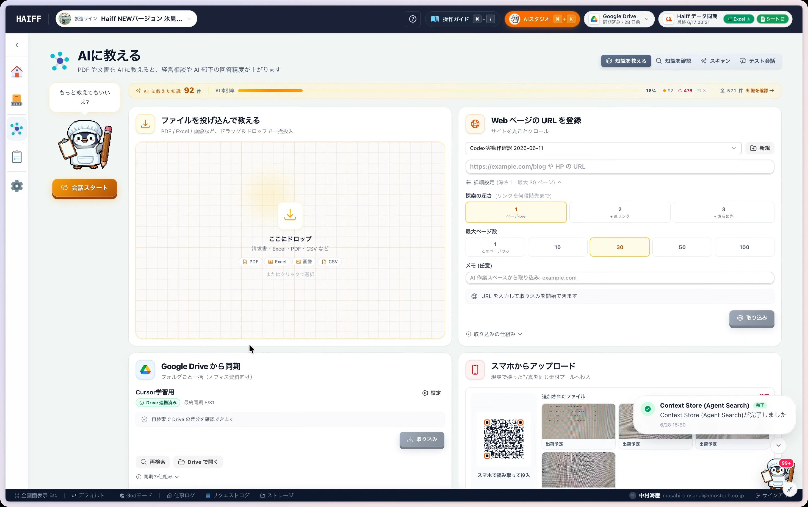
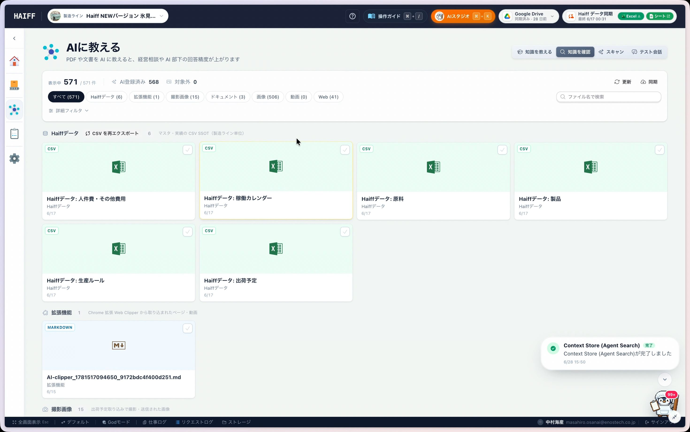
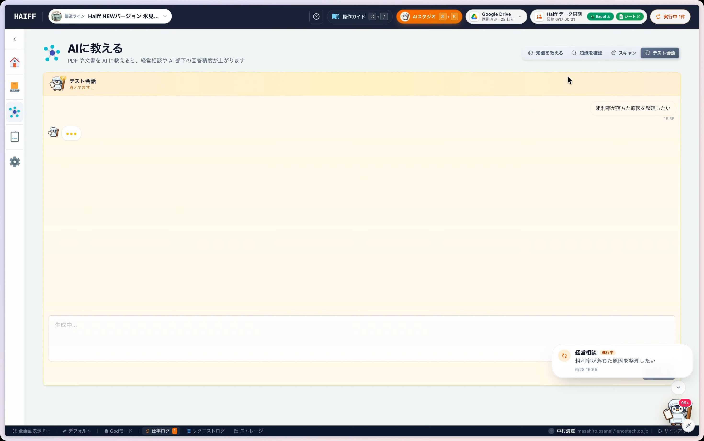

# Release Notes: AIに資料を教えて、仕事の相談ができるようになりました

リリース日: 2026-06-29

## Summary

手元の資料やWebページの内容をAIに教えて、その情報をもとに相談できる機能をリリースしました。

これまでは、AIに相談するたびに前提情報を説明したり、資料の要点を貼り付けたりする手間がありました。これからは、よく使う資料や参考情報を先にAIへ教えておくことで、AIが自分たちの業務文脈を踏まえて回答しやすくなります。

生産計画の相談、売上低下の要因整理、レポート作成、画像生成の依頼など、普段の仕事で「この資料を読んだうえで考えてほしい」と感じる場面で使えます。

## できるようになったこと

### いろいろな方法でAIに資料を教えられます

資料の置き場所や作業中の環境に合わせて、使いやすい方法を選べます。

- ファイルをドラッグアンドドロップする
- Webページを取り込む
- Google Driveから同期する
- スマホからアップロードする
- クリップボードの内容を貼り付ける

「これは使うかもしれない」と思った資料を、まずAIに入れておけるようになりました。

### 教えた内容をあとから確認できます

AIに教えた情報は、カテゴリーごとに整理された状態で確認できます。

「今、AIには何を教えてあるんだっけ？」と思ったときは、知識確認画面から一覧を見たり、詳細を開いて中身を見直したりできます。

### 本番の相談前に、テスト会話で試せます

教えた資料をAIがどのくらい理解しているか、テスト会話で確認できます。

たとえば、店舗情報を取り込んだあとに「売上が落ちた要因を整理して」と相談すると、登録済みの情報をもとにAIが考えてくれます。大事な相談を始める前に、AIの理解度を軽く試せるのが便利です。

## こんなときにおすすめです

- 会議資料や営業資料を読ませたうえで、要点を整理したい
- 店舗や商品ごとの情報をもとに、改善案を相談したい
- Google Driveにある資料を、AIとの会話に活用したい
- 毎回同じ説明をAIに入力する手間を減らしたい
- 重要な相談の前に、AIが資料を理解しているか確認したい

## 使い方のイメージ

1. AIに教えたい資料やWebページを取り込む
2. 知識確認画面で、取り込まれた内容を確認する
3. テスト会話で、資料に基づいた回答ができるか試す
4. 実際の業務相談やレポート作成に活用する

Google Driveをすでに連携している場合は、追加の連携操作なしで同期機能を使えます。

## Internal Notes

- Application: haiff
- StoryVault story: `HAIFFF-ST-AI-KNOWLEDGE-INGEST`

## Acceptance Criteria

- ユーザーは複数経路からAIへファイルを取り込める。
- 取り込んだ知識はカテゴリーごとに確認できる。
- テスト会話で登録済み知識に基づく回答を確認できる。

## Evidence

- StoryVault evidence: `evidence-haiff-ai-knowledge-ingest-video`
- Source asset: `source-asset-operation-video-32f101d2-ae5b-47ad-aebc-6a2b75895fc6-journey`
- Operation video: `operation-video-32f101d2-ae5b-47ad-aebc-6a2b75895fc6`

## Related Pull Requests

- ENOSTECH-inc/haiff PR 253: `feat: integrate mobile data intake and scans`
- ENOSTECH-inc/haiff PR 231: `Improve Google Drive import flow`
- ENOSTECH-inc/haiff PR 232: `Fix Drive sync import status and logs`
- ENOSTECH-inc/haiff PR 211: `[codex] Add web clipper and ingestion polish`
- ENOSTECH-inc/haiff PR 240: `Rename AI training label to teaching`
- ENOSTECH-inc/haiff PR 219: `[codex] Remove direct camera intake entry`
